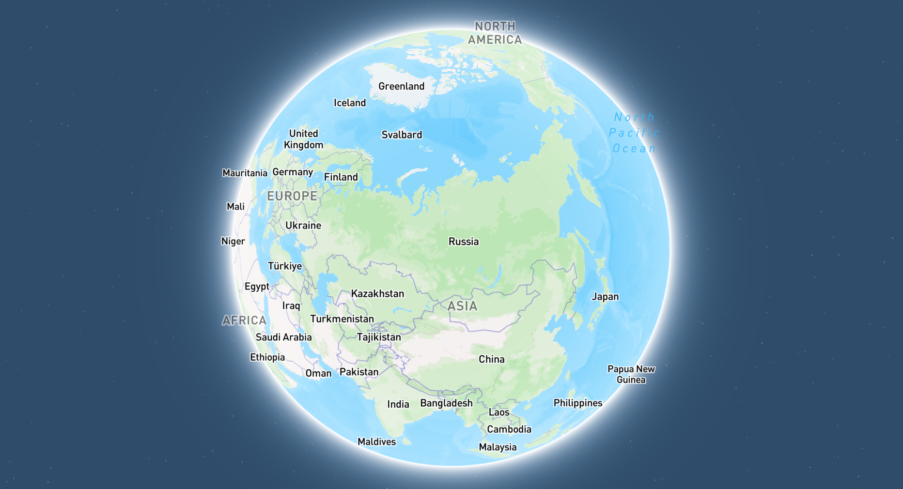

# MailPlanet 🌍📧

MailPlanet is a Next.js application that visualizes the geographic origin of incoming emails on an interactive 3D globe. It processes inbound emails via Postmark webhooks, performs IP geolocation, and displays the data on a Mapbox map.



## Features

- **Interactive 3D Globe**: Visualizes email origins using Mapbox GL JS.
- **Real-time Updates**: New emails appear on the map as they are processed.
- **IP Geolocation**: Determines the location of the email sender's IP address (actually the email provider's address).
- **Email Data Display**: Shows details like sender, subject, and location on map markers.
- **Database Integration**: Stores and retrieves IP location data using Drizzle ORM.
- **Postmark Webhook**: Processes inbound emails received through Postmark.

## Tech Stack

- **Framework**: [Next.js](https://nextjs.org/)
- **Language**: [TypeScript](https://www.typescriptlang.org/)
- **Mapping**: [Mapbox GL JS](https://docs.mapbox.com/mapbox-gl-js/api/)
- **Database ORM**: [Drizzle ORM](https://orm.drizzle.team/)
- **Styling**: [Tailwind CSS](https://tailwindcss.com/) (Assumed, common with Next.js)
- **Inbound Email**: [Postmark](https://postmarkapp.com/)
- **Geolocation API**: [Abstract API (IP Geolocation)](https://www.abstractapi.com/ip-geolocation-api) (or your chosen provider)

## Getting Started

### Prerequisites

- Node.js (v18.x or later recommended)
- npm, yarn, pnpm, or bun
- A Postmark account and an inbound email address configured.
- A Mapbox access token.
- An API key for an IP geolocation service (e.g., Abstract API).
- A database (e.g., PostgreSQL, MySQL, SQLite) compatible with Drizzle ORM.

### Installation

1.  **Clone the repository:**

    ```bash
    git clone https://github.com/your-username/mailplanet.git
    cd mailplanet
    ```

2.  **Install dependencies:**

    ```bash
    npm install
    # or
    yarn install
    # or
    pnpm install
    # or
    bun install
    ```

3.  **Set up environment variables:**
    Create a `.env.local` file in the root of the project by copying `.env.example` (if you create one) or by adding the following variables:

    ```env
    # .env.local
    DATABASE_URL="your_database_connection_string"

    NEXT_PUBLIC_MAPBOX_TOKEN="your_mapbox_public_access_token"
    GEOLOCATION_API_KEY="your_ip_geolocation_api_key"

    # Postmark inbound email address (optional, can be hardcoded or used for display)
    # POSTMARK_INBOUND_EMAIL="your-inbound-address@inbound.postmarkapp.com"
    ```

    Replace the placeholder values with your actual credentials.

4.  **Set up the database:**

    - Ensure your database server is running and accessible.
    - Apply database migrations using Drizzle Kit:
      ```bash
      npx drizzle-kit generate # To generate migration files if you change the schema
      npx drizzle-kit migrate  # To apply migrations to your database
      ```
      _(Note: `drizzle-kit migrate` is for specific drivers like PostgreSQL. For others like Turso/SQLite, you might use `drizzle-kit push` or apply migrations manually. Refer to Drizzle ORM documentation for your specific database.)_

5.  **Configure Postmark Webhook:**
    - In your Postmark account, go to your server, then to the "Settings" of your inbound email address.
    - Set the "Webhook URL" to `https://your-deployed-app-url.com/api/inbound-email`. For local development, you might need to use a tunneling service like ngrok (`ngrok http 3000` would give you a public URL like `https://xxxx.ngrok.io`, so the webhook URL would be `https://xxxx.ngrok.io/api/inbound-email`).

### Running the Development Server

```bash
npm run dev
# or
yarn dev
# or
pnpm dev
# or
bun dev
```

Open [http://localhost:3000](http://localhost:3000) with your browser to see the result.

## API Endpoints

- `POST /api/inbound-email`: Receives JSON payloads from Postmark for new emails. Extracts IP, performs geolocation, and stores data.
- `GET /api/iplocations`: Fetches all stored IP location data to be displayed on the map.

## Database

This project uses Drizzle ORM to interact with the database.

- **Schema**: Defined in [`src/db/schema.ts`](src/db/schema.ts).
- **Migrations**: Stored in the [`drizzle/migrations`](drizzle/migrations) directory.
- **Queries**: Custom database queries can be found in [`src/db/queries.ts`](src/db/queries.ts).

## Deployment

The easiest way to deploy your Next.js app is to use the [Vercel Platform](https://vercel.com/new?utm_medium=default-template&filter=next.js&utm_source=create-next-app&utm_campaign=create-next-app-readme) from the creators of Next.js.

Ensure your environment variables are set in your Vercel project settings.

Check out the [Next.js deployment documentation](https://nextjs.org/docs/app/building-your-application/deploying) for more details.

## License

Distributed under the [MIT License](LICENSE). See `LICENSE` file for more information.

## Author

Built by [Teddy ASSIH](https://www.linkedin.com/in/teddy-assih-b4204b254/)
